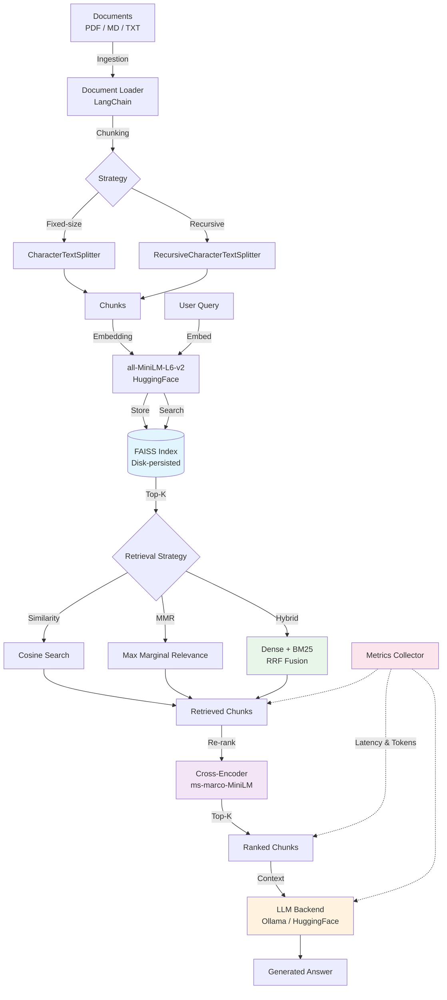

# RAG Pipeline

A production-quality Retrieval-Augmented Generation pipeline built with Python, FAISS, and Ollama. Runs entirely locally with no paid APIs.

## Architecture



## Features

- **Document ingestion**: PDF, Markdown, and plain text via LangChain loaders
- **Configurable chunking**: Fixed-size and recursive character splitting with overlap
- **Local embeddings**: sentence-transformers/all-MiniLM-L6-v2 (384-dim, runs on CPU)
- **FAISS vector store**: Disk-persisted index with save/load support
- **Triple retrieval**: Similarity search, MMR for diversity, and hybrid (dense + BM25 with RRF)
- **Cross-encoder re-ranking**: ms-marco-MiniLM-L-6-v2 for precision improvement
- **Local LLM generation**: Ollama (llama3, mistral) or HuggingFace (flan-t5) — no paid APIs
- **RAGAS-style evaluation**: Faithfulness, answer relevancy, context precision
- **Observability**: Per-stage latency tracking, token estimation, `/metrics` endpoint
- **Streamlit chat UI**: Interactive chat interface with source highlighting and live metrics
- **FastAPI server**: REST endpoints for ingestion, querying, and metrics
- **Docker support**: One-command deployment with `docker compose up`
- **Click CLI**: Commands for ingest, query, evaluate, serve, and ui
- **YAML configuration**: All settings configurable with env var overrides

## Quick Start

### Prerequisites

- Python 3.10+
- **Option A** — [Ollama](https://ollama.ai/) (recommended for best quality):

```bash
ollama pull llama3
# or
ollama pull mistral
```

- **Option B** — No Ollama? The pipeline ships with a **HuggingFace local backend** (`google/flan-t5-small`, ~80 MB) that runs entirely on CPU with no external services. Set the backend in `config.yaml`:

```yaml
generation:
  llm_backend: "huggingface"
  model_name: "google/flan-t5-small"
```

> **Note:** flan-t5-small is a lightweight demo model. It produces short, sometimes imprecise answers and low RAGAS evaluation scores. For production-quality generation and evaluation, use Ollama with llama3 or mistral.

### Installation

```bash
git clone https://github.com/Philopateer-Nabil/rag-pipeline.git
cd rag-pipeline

# Install the package
pip install -e .

# With dev dependencies (testing, linting)
pip install -e ".[dev]"

# With Streamlit UI
pip install -e ".[ui]"
```

Or using Make:

```bash
make install-dev
```

### Ingest Sample Data

```bash
rag ingest data/sample/
```

### Ask a Question

```bash
rag query "What is the Transformer architecture?"
```

### Start the API Server

```bash
rag serve
```

### Launch the Chat UI

```bash
rag ui
```

### Docker (one command)

```bash
docker compose up --build -d
# API at http://localhost:8000, UI at http://localhost:8501
```

### Run Evaluation

```bash
rag evaluate
```

## Usage

### CLI

```bash
# Ingest a directory or file
rag ingest data/sample/
rag ingest document.pdf

# Query with options
rag query "How does attention work?" --top-k 5 --strategy mmr --show-sources

# Use hybrid retrieval (dense + BM25)
rag query "What is FAISS?" --strategy hybrid

# Disable re-ranking
rag query "What is FAISS?" --no-rerank

# Run evaluation suite
rag evaluate --output my_report

# Start API server
rag serve --host 0.0.0.0 --port 8000

# Launch Streamlit UI
rag ui --port 8501

# Use a custom config
rag --config my_config.yaml query "What is RAG?"
```

### API

Once the server is running (`rag serve`):

```bash
# Health check
curl http://localhost:8000/health

# Ingest documents
curl -X POST http://localhost:8000/ingest \
  -H "Content-Type: application/json" \
  -d '{"path": "data/sample/"}'

# Upload a file
curl -X POST http://localhost:8000/ingest/upload \
  -F "file=@document.md"

# Query
curl -X POST http://localhost:8000/query \
  -H "Content-Type: application/json" \
  -d '{"question": "What is RAG?", "top_k": 5, "strategy": "hybrid"}'

# Pipeline metrics
curl http://localhost:8000/metrics
```

API docs available at `http://localhost:8000/docs` (Swagger UI).

### Python API

```python
from rag_pipeline.pipeline import RAGPipeline

pipeline = RAGPipeline(config_path="config.yaml")

# Ingest
pipeline.ingest("data/sample/")

# Query
result = pipeline.query("What is the Transformer architecture?")
print(result.answer)
print(f"Latency: {result.latency_ms:.0f}ms")
print(result.source_documents)

# Retrieve without generation
docs = pipeline.retrieve_only("attention mechanisms")

# Check metrics
from rag_pipeline.metrics import collector
print(collector.snapshot())
```

## Configuration

All settings are in `config.yaml`. Every setting can be overridden via environment variables prefixed with `RAG_`.

| Setting | YAML Path | Env Variable | Default | Description |
|---------|-----------|-------------|---------|-------------|
| Chunk strategy | `chunking.strategy` | `RAG_CHUNK_STRATEGY` | `recursive` | `fixed` or `recursive` |
| Chunk size | `chunking.chunk_size` | `RAG_CHUNK_SIZE` | `512` | Characters per chunk |
| Chunk overlap | `chunking.chunk_overlap` | `RAG_CHUNK_OVERLAP` | `64` | Overlap between chunks |
| Embedding model | `embedding.model_name` | `RAG_EMBEDDING_MODEL` | `all-MiniLM-L6-v2` | HuggingFace model |
| Index path | `vectorstore.index_path` | `RAG_INDEX_PATH` | `./data/faiss_index` | FAISS index directory |
| Retrieval strategy | `retrieval.strategy` | `RAG_RETRIEVAL_STRATEGY` | `mmr` | `similarity`, `mmr`, or `hybrid` |
| Top K | `retrieval.top_k` | `RAG_RETRIEVAL_TOP_K` | `5` | Documents to retrieve |
| MMR lambda | `retrieval.mmr_lambda` | `RAG_MMR_LAMBDA` | `0.5` | MMR diversity (0=diverse, 1=relevant) |
| RRF K | `retrieval.rrf_k` | — | `60` | RRF constant for hybrid search |
| Re-ranker enabled | `reranker.enabled` | `RAG_RERANKER_ENABLED` | `true` | Enable cross-encoder re-ranking |
| Re-ranker top K | `reranker.top_k` | `RAG_RERANKER_TOP_K` | `3` | Documents after re-ranking |
| LLM backend | `generation.llm_backend` | — | `ollama` | `ollama` or `huggingface` |
| LLM model | `generation.model_name` | `RAG_LLM_MODEL` | `llama3` | Ollama: `llama3`, `mistral`; HF: `google/flan-t5-small` |
| LLM base URL | `generation.base_url` | `RAG_LLM_BASE_URL` | `http://localhost:11434` | Ollama server URL |
| Temperature | `generation.temperature` | `RAG_LLM_TEMPERATURE` | `0.1` | Generation temperature |
| Max tokens | `generation.max_tokens` | `RAG_LLM_MAX_TOKENS` | `1024` | Max generation tokens |

## Project Structure

```
rag-pipeline/
├── config.yaml                 # Default configuration
├── pyproject.toml              # Package metadata and dependencies
├── Makefile                    # Common commands
├── Dockerfile                  # Container image
├── docker-compose.yml          # Full stack (API + UI + Ollama)
├── .dockerignore
├── data/
│   └── sample/                 # Sample AI/ML documents (7 files)
├── src/rag_pipeline/
│   ├── __init__.py
│   ├── config.py               # YAML + env var configuration
│   ├── ingestion.py            # Document loading (PDF/MD/TXT)
│   ├── chunking.py             # Text splitting strategies
│   ├── embeddings.py           # HuggingFace embedding model
│   ├── vectorstore.py          # FAISS index management
│   ├── retrieval.py            # Similarity, MMR, and hybrid search
│   ├── hybrid_retrieval.py     # BM25 + dense retrieval with RRF fusion
│   ├── reranker.py             # Cross-encoder re-ranking
│   ├── generation.py           # LLM generation (Ollama + HuggingFace)
│   ├── pipeline.py             # End-to-end orchestration
│   ├── metrics.py              # Observability: latency, tokens, counters
│   ├── ui.py                   # Streamlit chat interface
│   ├── api/
│   │   ├── app.py              # FastAPI application factory
│   │   ├── schemas.py          # Pydantic request/response models
│   │   └── routes.py           # API endpoint handlers (+/metrics)
│   ├── cli/
│   │   └── main.py             # Click CLI commands
│   └── evaluation/
│       ├── metrics.py          # RAGAS-style eval metrics
│       ├── dataset.py          # Synthetic eval QA pairs (14 samples)
│       └── runner.py           # Evaluation orchestrator
└── tests/
    ├── conftest.py             # Shared fixtures
    ├── test_chunking.py        # Chunking logic tests
    ├── test_retrieval.py       # Retrieval and reranker tests
    ├── test_hybrid.py          # BM25 and RRF fusion tests
    ├── test_metrics.py         # Observability tests
    ├── test_api.py             # FastAPI endpoint tests
    └── test_config.py          # Configuration tests
```

## Testing

```bash
# Run all tests (48 tests)
make test

# With coverage
make test-cov

# Lint
make lint
```

## Docker Deployment

The `docker-compose.yml` brings up the full stack:

| Service | Port | Description |
|---------|------|-------------|
| `ollama` | 11434 | LLM backend with health check |
| `ollama-pull` | — | Auto-pulls the llama3 model on first start |
| `api` | 8000 | FastAPI server (Swagger UI at `/docs`) |
| `ui` | 8501 | Streamlit chat interface |

```bash
# Start everything
docker compose up --build -d

# Ingest documents via the API
curl -X POST http://localhost:8000/ingest \
  -H "Content-Type: application/json" \
  -d '{"path": "data/sample/"}'

# Open the chat UI
open http://localhost:8501

# Tear down
docker compose down
```

## Design Decisions

### Why FAISS over ChromaDB?

**FAISS** was chosen for several reasons:

1. **Battle-tested at scale**: Developed and used at Meta for billion-scale similarity search. ChromaDB is newer and less proven at scale.
2. **Performance**: FAISS provides superior query latency, especially with optimized indices (IVF, HNSW). For the same dataset, FAISS typically benchmarks 2-5x faster.
3. **Index flexibility**: FAISS offers multiple index types (Flat, IVF, HNSW, PQ) that can be composed for specific performance/accuracy tradeoffs. ChromaDB abstracts this away, limiting optimization.
4. **No infrastructure overhead**: FAISS is a library, not a service. It loads directly into your process with no separate server to manage. ChromaDB's client-server mode adds complexity.
5. **GPU support**: FAISS can offload indexing and search to GPU for massive throughput gains. Essential for production workloads.

The tradeoff: FAISS lacks built-in metadata filtering and document management that ChromaDB provides. For this pipeline, LangChain's FAISS wrapper handles metadata adequately.

### Why all-MiniLM-L6-v2?

1. **Speed**: 6-layer architecture encodes 14,000 sentences/second on a V100, making it practical for CPU-only deployments.
2. **Size**: 80MB model, 384-dimension embeddings. Low memory and storage footprint.
3. **Quality**: Competitive performance on STS benchmarks despite its compact size. The quality/speed tradeoff is the best available for resource-constrained deployments.
4. **Free and local**: No API keys, no usage costs, no data leaving your machine.

For higher quality at the cost of speed, swap to `all-mpnet-base-v2` (768 dimensions) in the config.

### Why MMR (Maximal Marginal Relevance)?

Pure similarity search often returns near-duplicate chunks from the same section of a document. MMR balances relevance with diversity:

```
MMR = argmax[λ · Sim(d, q) - (1 - λ) · max(Sim(d, d_selected))]
```

With λ=0.5 (default), MMR selects documents that are both relevant to the query and different from already-selected documents. This produces better context for generation because the LLM sees information from multiple perspectives rather than redundant text.

### Why Hybrid Search (Dense + BM25)?

Dense retrieval (embedding similarity) excels at semantic matching but can miss queries with specific keywords, technical terms, or proper nouns that the embedding model hasn't seen. BM25 (sparse lexical matching) catches these exact-match cases.

Hybrid search combines both via **Reciprocal Rank Fusion (RRF)**:

```
RRF_score(d) = Σ 1/(k + rank_i(d))  across all ranked lists
```

RRF is robust to score scale differences between the two retrieval methods and requires no learned fusion weights. The constant `k=60` (from the original paper) balances the contribution of high-ranked vs. lower-ranked documents.

In practice, hybrid search consistently outperforms either method alone, particularly for technical/domain-specific queries.

### Chunk Size Tradeoffs

The default chunk size of 512 characters with 64-character overlap represents a deliberate balance:

| Chunk Size | Pros | Cons |
|-----------|------|------|
| Small (128-256) | Precise retrieval, less noise | May lack context, more chunks to search |
| Medium (512) | Good context/precision balance | Default sweet spot for most use cases |
| Large (1024+) | Rich context per chunk | Diluted relevance signal, higher token cost |

The 64-character overlap ensures that information at chunk boundaries isn't lost. Recursive splitting respects document structure (paragraphs > sentences > words) rather than cutting mid-sentence.

### Why Cross-Encoder Re-ranking?

Initial retrieval uses a bi-encoder (embedding model) which independently embeds the query and documents. This is fast but limited: it cannot model fine-grained query-document interactions.

The cross-encoder (ms-marco-MiniLM-L-6-v2) processes the query and document jointly, attending to cross-sequence interactions. This produces significantly more accurate relevance scores. The two-stage retrieve-then-rerank pipeline gives us the speed of bi-encoder retrieval with the accuracy of cross-encoder scoring.

### Observability

Production RAG systems need visibility into each pipeline stage. This project tracks:

- **Per-stage latency** (retrieval, reranking, generation) with min/avg/max
- **Token estimation** for cost awareness
- **Query and ingestion counters**
- Accessible via `GET /metrics` API endpoint and the Streamlit sidebar

## License

MIT
